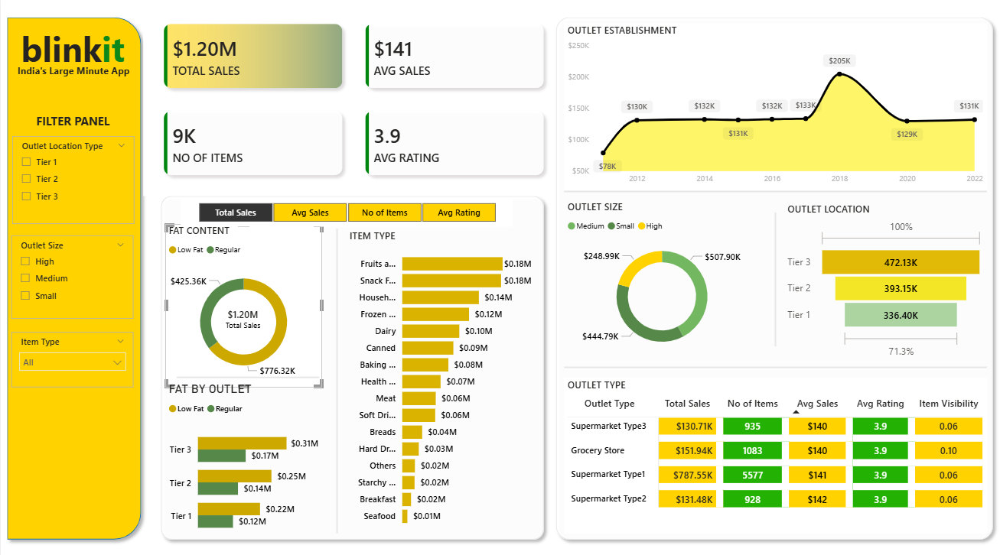

# 🛒 Blinkit Sales Analytics Dashboard | Power BI
An interactive Power BI dashboard designed to analyze Blinkit's sales performance, outlet characteristics, product categories, and customer ratings. The dashboard provides actionable business insights through KPIs, visual analytics, and dynamic filtering.

## 📌 Project Overview

This project is an interactive **Blinkit Sales Analytics Dashboard** developed using **Microsoft Power BI** to analyze Blinkit's business performance. The dashboard provides valuable insights into sales trends, outlet performance, product categories, customer ratings, and inventory distribution.

The goal of this project is to transform raw data into meaningful business insights that support data-driven decision-making.

---

## 📊 Dashboard Preview




---

## 🎯 Business Objectives

* Monitor overall sales performance.
* Analyze outlet-wise sales contribution.
* Identify top-performing product categories.
* Compare sales across outlet sizes and locations.
* Track average ratings and item visibility.
* Create an interactive dashboard for business analysis.

---

## 📈 Key Performance Indicators (KPIs)

| Metric          | Value  |
| --------------- | ------ |
| Total Sales     | $1.20M |
| Average Sales   | $141   |
| Number of Items | 9K     |
| Average Rating  | 3.9    |

---

## 📌 Dashboard Features

### ✅ KPI Cards

* Total Sales
* Average Sales
* Number of Items
* Average Rating

### ✅ Sales Trend Analysis

* Outlet Establishment Trends
* Year-wise Sales Performance

### ✅ Product Analysis

* Item Type Performance
* Fat Content Distribution

### ✅ Outlet Analysis

* Outlet Size Analysis
* Outlet Location Analysis
* Outlet Type Comparison

### ✅ Interactive Filters

* Outlet Location Type
* Outlet Size
* Item Type

### ✅ Detailed Performance Table

* Total Sales
* Number of Items
* Average Sales
* Average Rating
* Item Visibility

---

## 🔍 Key Insights

* Tier 3 outlets generated the highest sales revenue.
* Fruits and Snack Foods are among the top-selling product categories.
* Medium-sized outlets contribute significantly to overall sales.
* Customer ratings remain consistently high across outlet types.
* Sales performance has remained stable across establishment years.

---

## 🛠️ Tools & Technologies Used

* Microsoft Power BI
* Power Query
* DAX (Data Analysis Expressions)
* Data Modeling
* Data Visualization

---

## 💡 Skills Demonstrated

* Data Cleaning & Transformation
* Dashboard Design
* Business Intelligence Reporting
* KPI Development
* DAX Calculations
* Data Analysis
* Interactive Visualization
* Business Insight Generation

---

## 📂 Repository Structure

```text
blinkit-sales-dashboard-powerbi/
│
├── Dashboard.pbix
├── dataset.csv
├── README.md
└── screenshots/
    └── blinkit-dashboard.png
```

---

## 🚀 How to Use

1. Download the repository.
2. Open the `.pbix` file in Power BI Desktop.
3. Refresh the dataset if required.
4. Explore the dashboard using interactive filters and slicers.

---

## 📷 Dashboard Highlights

### Sales Overview

* KPI Cards for quick business monitoring.

### Product Performance

* Item category analysis.
* Fat content comparison.

### Outlet Analysis

* Outlet size and location performance.
* Outlet type comparison.

---

## 👨‍💻 Author

**Manas Meher**

Aspiring Data Analyst | Power BI | SQL | Python | Machine Learning

---

## ⭐ If you found this project useful, consider giving it a star on GitHub!
